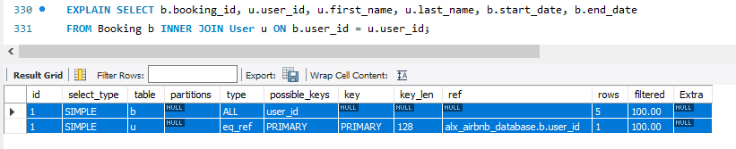

# Task 3: Index Performance Analysis

## Overview
This file documents the performance analysis for Task 3 of the Unleashing Advanced Querying Power project, part of the ALX Airbnb Database Module. There was the identification of high-usage columns in the User, Booking, and Property tables, creation of indexes in database_index.sql, and measurement of query performance before and after indexing using MySQL’s EXPLAIN.

This report analyzes three queries, focusing on User.user_id (PRIMARY KEY), Booking.user_id (idx_booking_user_id), Booking.start_date (idx_booking_start_date), and Property.name (idx_property_name).

## Test Performance
QUERY 1
```
EXPLAIN SELECT b.booking_id, u.user_id, u.first_name, u.last_name, b.start_date, b.end_date
FROM Booking b INNER JOIN User u ON b.user_id = u.user_id;
```
**Before Indexing**



**After Indexing**


QUERY 2
```
EXPLAIN SELECT u.user_id, u.first_name, u.last_name
FROM User u WHERE (SELECT COUNT(*) FROM Booking b WHERE b.user_id = u.user_id) > 3;
```
**Before Indexing**


**After Indexing**


QUERY 3
```
EXPLAIN SELECT p.property_id, p.name, p.location
FROM Property p WHERE p.name = 'Cozy Cottage';
```
**Before Indexing**


**After Indexing**


QUERY 4
```
EXPLAIN SELECT b.booking_id, b.start_date, b.total_price
FROM Booking b WHERE b.start_date BETWEEN '2025-06-01' AND '2025-08-31';
```
**Before Indexing**


**After Indexing**

